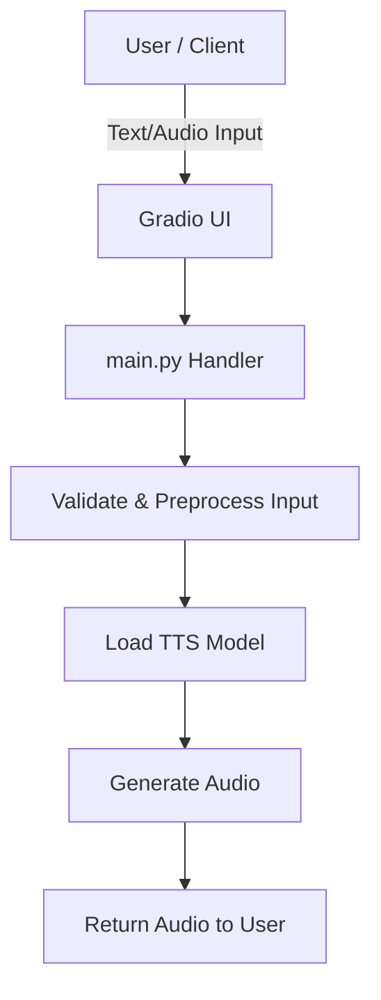

# Local Voice Cloning App

Minimal voice cloning experiment. This repository contains a small Python app that runs a voice-cloning workflow (load model, accept input, synthesize audio). The project is lightweight and uses the `uv` helper/runner (see run instructions) to sync dependencies and run the app.

## Clone the repository

Clone the repo to your machine (replace `<repo-url>` with the repository HTTPS or SSH URL):

```bash
git clone <repo-url>
cd voice-cloned-app
```

## Install / sync dependencies

This project uses `uv` as the local helper for syncing and running. If your project expects a different tool, you can also use the normal Python tooling (pip, poetry, etc.).

To sync dependencies with `uv`:

```bash
uv sync
```

If you don't have `uv` available, use your normal environment setup (for example, create a venv and install packages listed in `pyproject.toml`).

## Run the app

Run locally (default, not publicly exposed):

```bash
uv run main.py
```

Run in "public" mode (if the app supports exposing an endpoint or external access):

```bash
uv run main.py --public
```

Fallback (if you prefer running directly with Python):

```bash
source .venv/bin/activate  # (linux/mac)
python main.py
```

**Note:** The app will automatically use your CUDA GPU (NVIDIA) if available for faster inference. If no compatible GPU is found, it will fall back to CPU mode automatically.

## .env file — what to put there

A `.env` file is already included in the repository for your convenience. **Review and update as needed before running the app.** Do not share sensitive information from `.env` publicly.

Example `.env`

```ini
# Internal environment variables (for transformers/diffusers)
TRANSFORMERS_ATTN_IMPLEMENTATION=eager   # Use eager attention implementation for HuggingFace Transformers (improves compatibility)
TOKENIZERS_PARALLELISM=false             # Disable parallelism in tokenizers to avoid warning spam
TRANSFORMERS_VERBOSITY=error             # Only show error logs from HuggingFace Transformers
DIFFUSERS_VERBOSITY=error                # Only show error logs from HuggingFace Diffusers
```

## High-level architecture (Mermaid)

The following Mermaid diagram shows the core flow of the app. Save it in this README or render it in a Markdown viewer that supports Mermaid.



This diagram is intentionally generic. If you want a more detailed sequence diagram (for async tasks, queues, or third-party API calls), tell me which modules to include and I will expand it.

## How to contribute

We welcome contributions. A minimal workflow:

1. Fork the repository.
2. Create a branch for your change: `git checkout -b feat/your-feature`.
3. Make changes and add tests where applicable.
4. Run any project linters/tests and ensure they pass.
5. Commit with clear messages and push your branch: `git push origin feat/your-feature`.
6. Open a Pull Request against the `main` branch, describe the change, and reference any related issues.
7. Address any feedback and iterate as needed.
